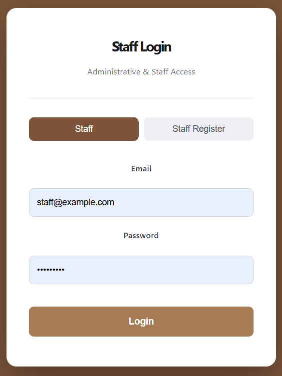
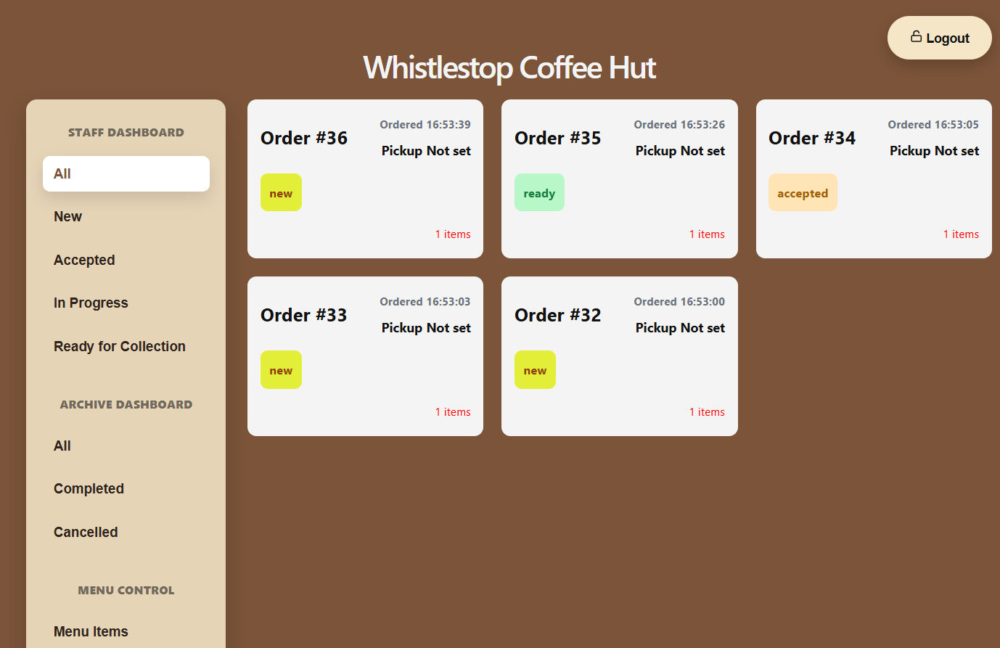
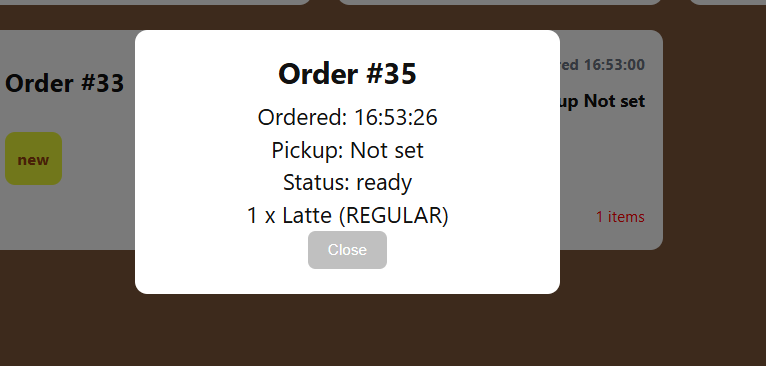
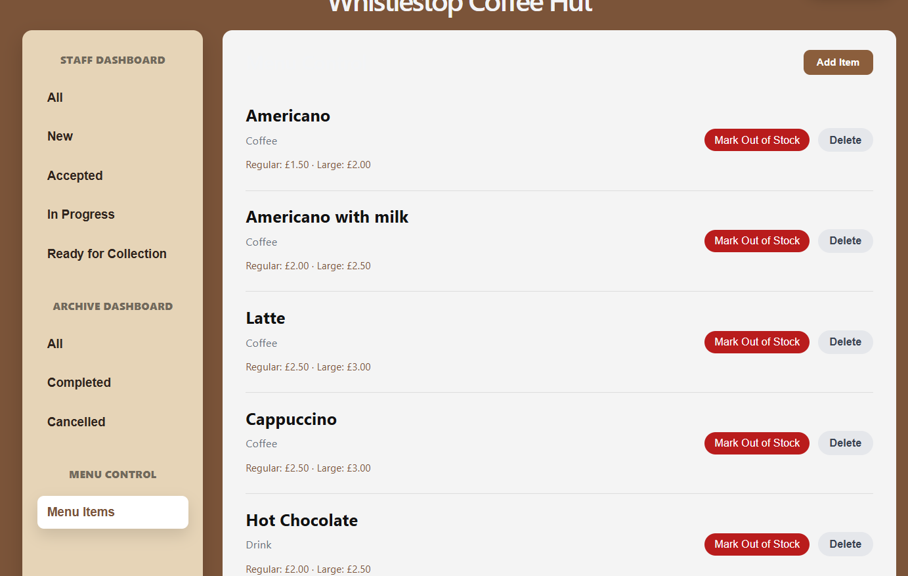

# ☕ Whistlestop Coffee Hut — Staff Dashboard

Frontend-focused showcase of a full-stack coffee shop management system built for the CSC8019 group project at Newcastle University.

Developed using React and JavaScript, this project includes a staff dashboard, order workflow management, menu control features, and backend API integration. 
Backend services were implemented separately using Spring Boot.

---

## 📸 Screenshots







---

## ✨ Features

- **JWT Authentication** — Staff login and registration with token-based auth
- **Live Order Tracking** — Dashboard auto-refreshes every 3 seconds
- **Order Status Management** — Accept, prepare, mark as ready, and collect orders
- **Order Archive System** — View completed and cancelled orders
- **Menu Control Panel** — Add, delete, and mark items as out of stock in real time
- **Order Detail Modal** — Click any order card to see full item breakdown

---

## 🛠️ Tech Stack

Frontend

- React (Functional Components & Hooks)
- JavaScript
- CSS (custom, no UI library)
- Vite

Backend Integration

- REST API integration
- JWT authentication via localStorage
- Spring Boot backend services

Tools

- Docker
- Git
- GitHub
- Figma

---

## 🚀 Getting Started

```bash
# Install dependencies
npm install

# Start the development server
npm run dev
```

> **Note:** This frontend connects to a Spring Boot backend running on `localhost:8080`.  
> The backend must be running for the dashboard to function.

---

## 📁 Project Structure

```
src/
├── components/
│   ├── DashboardSidebar.jsx   # Sidebar navigation
│   ├── LoginPage.jsx          # Login & register page
│   ├── MenuControl.jsx        # Menu management
│   ├── OrderCard.jsx          # Individual order card
│   └── OrderModal.jsx         # Order detail popup
├── App.jsx                    # Main app & state management
└── App.css                    # Global styles
```

---

## 👤 My Contribution

This was a team project. My responsibilities:

- Built the React frontend and staff dashboard interface
- Designed and implemented all UI components
- Integrated with backend REST APIs
- Handled JWT token storage and auth headers
- Implemented real-time order polling
- Implemented interactive Order Detail Modal components
- Created the Menu Control interface for stock management


---

*Built as part of a university/personal project.*